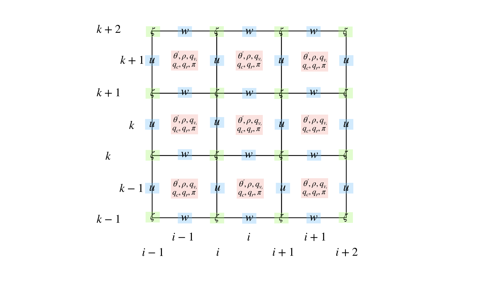

Model Design 
=================================

Governing Equation Set
----------------------
.. math::
   \begin{aligned}
       \frac{\partial \zeta}{\partial t} &= -\left(\frac{\partial (u\zeta)}{\partial x} + \frac{1}{\overline{\rho}}\frac{\partial (\overline{\rho} w\zeta)}{\partial z}\right) + \frac{g}{\rho_0} \frac{\partial (\frac{\theta_v'}{\overline{\theta_v}} - q_c - q_r)}{\partial x} +  K_x \frac{\partial ^2 \zeta}{\partial x^2} + K_z\frac{\partial ^2 \zeta}{\partial z^2} \\
       \frac{\partial \theta}{\partial t} &= -\left(\frac{\partial u\theta}{\partial x} + \frac{1}{\overline{\rho}}\frac{\partial \overline{\rho} w\theta}{\partial z}\right) + \frac{L_v}{C_p \overline{\pi}}(C-E)   +  K_x \frac{\partial ^2 \theta}{\partial x^2} + K_z\frac{\partial ^2 \theta}{\partial z^2} \\
       \frac{\partial q_v}{\partial t} &= -\frac{\partial uq_v}{\partial x} - \frac{1}{\overline{\rho}}\frac{\partial \overline{\rho}wq_v}{\partial z} - C + E + K_x\frac{\partial^{2} q_v}{\partial x^{2}} + K_z\frac{\partial^{2} q_v}{\partial z^{2}}\\
       \frac{\partial q_c}{\partial t} &= -\frac{\partial uq_c}{\partial x} - \frac{1}{\overline{\rho}}\frac{\partial \overline{\rho}wq_c}{\partial z} + C - A - B  +K_x\frac{\partial^{2} q_c}{\partial x^{2}} +  K_z\frac{\partial^{2} q_c}{\partial z^{2}}\\
       \frac{\partial q_r}{\partial t} &= -\frac{\partial uq_r}{\partial x} - \frac{1}{\overline{\rho}}\frac{\partial \overline{\rho}(w - \vec{V_T})q_r}{\partial z} + A + B - E + K_x\frac{\partial^{2} q_r}{\partial x^{2}} + K_z\frac{\partial^{2} q_r}{\partial z^{2}}\\
       \frac{\partial \zeta}{\partial x} &= \frac{\partial^2 w}{\partial x^{2}} + \frac{\partial}{\partial z}\left(\frac{1}{\overline{\rho}}\frac{\partial (\overline{\rho}w)}{\partial z}\right)\\
       u_{top} &= u_{\chi} + \bar{u}^{xy}, u_x = \frac{\partial \chi}{\partial x}\\
       \frac{\partial^2 \chi}{\partial x^2} &= -\frac{1}{\bar{\rho}}\frac{\partial \bar{\rho} w}{\partial z}\\
       \frac{\partial \bar{u}^{xy}}{\partial t} &= -\frac{1}{\overline{\rho}}\frac{\partial (\overline{\rho}\ \overline{uw}^{xy})}{\partial z} \\
       u &= \int_{z_{top}}^{z_{bottom}} (\frac{\partial w}{\partial x} - \overline{\rho}\zeta)dz + u_{top} \\
   \end{aligned}

How this model works
--------------------
   1. Predict :math:`\zeta,\ \theta,\ q_v,\  q_c,\ q_r`
   2. Solving 2D poisson equation to get :math:`w`. The detailed process will be shown below.
   3. Solving 1D poisson equation for :math:`\chi` and integrate from model top to get :math:`u` in the domain.
   4. Iterate to the next step
   

Grid Setting
------------

Discretization of the Governing Equation Set
--------------------------------------------

Advection for thermo-related variables
~~~~~~~~~~~~~~~~~~~~~~~~~~~~~~~~~~~~~~
Here presents the discretization for variables such as :math:`\theta,\ q_v,\ q_c,\ q_r`.

.. math::

   \frac{\partial q}{\partial t} = -\frac{\partial uq_v}{\partial x} - \frac{1}{\overline{\rho}}\frac{\partial \overline{\rho}wq_v}{\partial z} = -\frac{1}{dx} (F_r - F_l) - \frac{1}{dz} (F_u - F_d) 

.. math::

   F_r &= u_{i+1,k}(q_{i+1,k} - q_{i,k}),\ F_l = u_{i,k}(q_{i,k} - q_{i-1,k})\\
   F_u &= w_{i,k+1}(q_{i,k+1} - q_{i,k}),\ F_d = w_{i,k}(q_{i,k} - q_{i,k-1})

Advection for vorticity
~~~~~~~~~~~~~~~~~~~~~~~~
The reason why we need to process the advection for vorticity seperately is due to the conservation of enstrophy.
According to Arakawa (1966), the enstrophy needs to be conserved to do the long-term integration. 
Here, the J6 Arakawa jacobian is adopted to conserve the enstrophy following the techinical report in Jung (2005) for 3DVVM.

.. math::

   \frac{\partial \zeta}{\partial t} = -\frac{\partial u\zeta}{\partial x} - \frac{1}{\overline{\rho}}\frac{\partial \overline{\rho}w\zeta}{\partial z} = -\frac{1}{dx} (F_r - F_l) - \frac{1}{dz} (F_u - F_d) 

.. math::

   F_r &= U_{i,k}(\zeta_{i+1,k} - \zeta_{i,k}),\ F_l = U_{i-1,k}(\zeta_{i,k} - \zeta_{i-1,k})\\
   F_u &= W_{i,k}(\zeta_{i,k+1} - \zeta_{i,k}),\ F_d = W_{i,k-1}(\zeta_{i,k} - \zeta_{i,k-1})\\
   U_{i,k} &= 0.25 \times (\overline{\rho}_k(u_{i+1,k} + u_{i,k}) + \overline{\rho}_{k-1}(u_{i+1,k-1} + u_{u,k-1}) )

Solving 2D Poisson equation to diagnize w
~~~~~~~~~~~~~~~~~~~~~~~~~~~~~~~~~~~~~~~~~

.. math::
       \frac{\partial \zeta}{\partial x} &= \frac{\partial^2 w}{\partial x^{2}} + \frac{\partial}{\partial z}\left(\frac{1}{\overline{\rho}}\frac{\partial (\overline{\rho}w)}{\partial z}\right)\\

Solving 1D Poisson equation to diagnize u
~~~~~~~~~~~~~~~~~~~~~~~~~~~~~~~~~~~~~~~~~~

Numerical Method
=========================

Boundary Condition
===================
